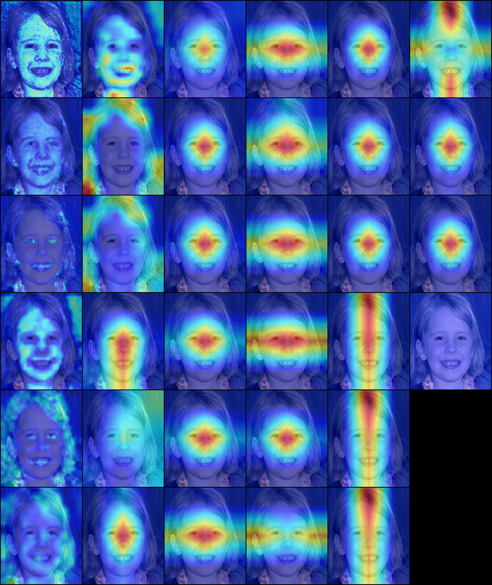
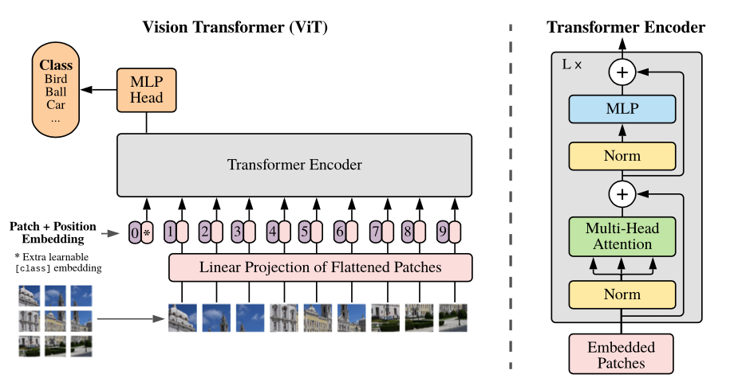

# About Me
---

I'm a recent graduate of UIUC's MCS Master's program of Computer Science with a keen interest in software development with a focus in data-heavy fields like machine learning, data science, and database systems. Throughout my education, I've gained a variety of skills and experiences that bolstered my software development, leadership, and presentation skills that enable me to tackle even the toughest challenges.

Check out some of the [projects](#projects-showcase) I've done and the [courses](#courses) I've taken at UIUC below!

# Projects Showcase
---

During my time at UIUC, I had the opportunity to lead several different projects which developed my skills in backend data-focused domains like machine learning, database systems, and backend API development. I have listed several of my major projects below, each of which contains a brief description of some interesting challenges I had to tackle when completing them. 

**Major Projects**

- [Electric Vehicle Trip Planner](#electric-vehicle-trip-planner)
- [Explainable Real vs GAN Face Discrimination](#explainable-real-vs-gan-face-discrimination)
- [CIFAR-10 Benchmarking](#cifar-10-benchmarking)
- [Paint by Numbers Generator](#paint-by-numbers-generator)
- [Stylized Handwriting Generation](#stylized-handwriting-generation)


## Electric Vehicle Trip Planner
---

> [!NOTE] Project Overview
> - Designed, normalized, and fully implemented MySQL database with advanced queries and features like indexing, constraints, stored procedures, and triggers.
> - Fully implemented an application backend with CRUD functionality to connect to the database and execute queries with correct isolation levels and connection management.
> - Optimized database schema and indexing to provide query cost reductions of 30x for location based queries. 

GitHub Repository:
https://github.com/cs411-alawini/fa24-cs411-team087-2AndAHalfAsians

In this project, I led a team of students to implement an electric vehicle trip planner centered around a MySQL database. The project's overall goal was to provide users an easy way to compare and contrast different electric vehicles for trip viability by giving users an intuitive way to visualize things like charger availability, charging costs, and potential traffic in the vicinity of charging stations. 

My role as leader was to guide the project's overall direction by keeping track of feature deadlines, coordinating with group members, and keeping the team organized to ensure our project surpassed their expectations. In addition to my role as a leader, I focused on many of the core backend aspects of the project like the database design and implementation itself as well as the majority of the backend infrastructure our frontend relied on. I also wrote many of the advanced queries we used, and performed various calculations for a traffic heatmap to visualize traffic around EV charging stations. 

The entire application is deployed and hosted on GCP with the frontend being accessible here (as long as I have free GCP credits remaining).
https://team087-frontend-410247726474.us-central1.run.app


- An example of the heatmap visualizations I did the backend calculations & queries for to visualize traffic congestion around different EV charging stations.


- The final Entity Relationship diagram for our database.

**Optimizing Database Performance**

Database performance was a large concern for our group, as we often needed to compute several things like point-to-point distances which become extremely expensive as we add more points to compute. To reduce this high overhead, I tested and evaluated a variety of indexing strategies, ultimately creating indices over latitude and longitude fields which is similar to a spatial indexing strategy. 

Since indexes in MySQL are implemented with B-trees, we can leverage the fast lookups they provide by performing `BETWEEN` query operations. The `BETWEEN` operator is extremely fast with B-trees since we can easily iterate over leaf nodes after finding the appropriate starting point in the tree.


- If we want to use a `BETWEEN` operator here to find people between ages of 20-70, we can efficiently navigate to the 20 leaf node, then iterate the leaf blocks until we find a record that is 71 or higher since indexes are always ordered.

```MySQL
WHERE
    -- This essentially creates a latitude between myLat +/- 20km
    latitude  
    BETWEEN myLat - (distance_threshold/111.0)  
        AND myLat + (distance_threshold/111.0)  
    AND  
    longitude  
    BETWEEN myLong - (distance_threshold/(111.0 * COS(RADIANS(myLat)) ))  
        AND myLong + (distance_threshold/(111.0 * COS(RADIANS(myLat)) ))
```
- In our stored procedure seen below, we use this index filtering by creating a square threshold around some current latitude and longitude to quickly filter out irrelevant results.

**Advanced Stored Procedure**

One project requirement we needed to have was to have a complex stored procedure that would implement a critical application function. For our application, we knew that finding point-to-point distances with a latitude and longitude was an often used feature for finding nearby charging stations and traffic monitoring stations. In our case, it made sense to implement this as a stored procedure in pure SQL so we could easily find pointwise distances.

```MySQL
DELIMITER //  
CREATE PROCEDURE HaversineDistance (  
IN myLat DECIMAL(8,6),  
IN myLong DECIMAL(9,6),  
IN distance_threshold FLOAT,  
IN targetTable VARCHAR(20)  
)  
BEGIN  
  
CASE  
WHEN targetTable = 'EVStation' THEN  
    DROP TABLE IF EXISTS EVStationDistances;  
    -- Create TEMPORARY table for connection specific results  
    CREATE TEMPORARY TABLE EVStationDistances(  
        latitude DECIMAL(8,6),  
        longitude DECIMAL(9,6),  
        ev_station_id INT,  
        distance_km FLOAT  
    );  
  
    INSERT INTO EVStationDistances  
    SELECT  
        latitude,  
        longitude,  
        station_id AS ev_station_id,  
        ROUND(  
            (  
            6371 * 2 * ASIN(  
                SQRT(  
                    POWER(SIN(RADIANS((latitude - myLat) / 2)), 2) +  
                    COS(RADIANS(myLat)) *  
                    COS(RADIANS(latitude)) *  
                    POWER(SIN(RADIANS(longitude - myLong) / 2), 2)  
                )  
            )  
        ), 3) AS distance_km  
    FROM EVStation  
    WHERE  
        latitude  
        BETWEEN myLat - (distance_threshold/111.0)  
            AND myLat + (distance_threshold/111.0)  
        AND  
        longitude  
        BETWEEN myLong - (distance_threshold/(111.0 * COS(RADIANS(myLat)) ))  
            AND myLong + (distance_threshold/(111.0 * COS(RADIANS(myLat)) ))  
    HAVING distance_km <= distance_threshold;  
  
WHEN targetTable = 'TrafficStation' THEN  
    DROP TABLE IF EXISTS TrafficStationDistances;  
    CREATE TEMPORARY TABLE TrafficStationDistances(  
        latitude DECIMAL(8,6),  
        longitude DECIMAL(9,6),  
        station_id VARCHAR(100),  
        state_code VARCHAR(2),  
        distance_km FLOAT  
    );  
    INSERT INTO TrafficStationDistances  
    SELECT  
        latitude,  
        longitude,  
        station_id,  
        state_code,  
        ROUND(  
            (  
            6371 * 2 * ASIN(  
                SQRT(  
                    POWER(SIN(RADIANS((latitude - myLat) / 2)), 2) +  
                    COS(RADIANS(myLat)) *  
                    COS(RADIANS(latitude)) *  
                    POWER(SIN(RADIANS(longitude - myLong) / 2), 2)  
                )  
            )  
        ), 3) AS distance_km  
    FROM TrafficStation  
    WHERE  
        latitude  
        BETWEEN myLat - (distance_threshold/111.0)  
            AND myLat + (distance_threshold/111.0)  
        AND  
        longitude  
        BETWEEN myLong - (distance_threshold/(111.0 * COS(RADIANS(myLat)) ))  
            AND myLong + (distance_threshold/(111.0 * COS(RADIANS(myLat)) ))  
    HAVING distance_km <= distance_threshold;  
END CASE;  
END //  
DELIMITER ;
```
- An example of one of the complex stored procedures I implemented used to calculate the distance between 2 latitude and longitudes by implementing the [Haversine Distance](https://www.geeksforgeeks.org/haversine-formula-to-find-distance-between-two-points-on-a-sphere/).

## Explainable Real vs GAN Face Discrimination
---

> [!NOTE] Project Overview
> - Led a team of graduate students to help identify deep-fake images with deep learning models with nearly 97% accuracy on unseen data.
> - Implemented custom and industry standard architectures like SWIN and ViT using PyTorch and analyzed results to contrast performance between models.
> - Visualized important image features with GradCAM library to understand a model's thought process.

GitHub Repository:
https://github.com/MarkBauer5/3-best-friends


- Can you tell which images are real?

With the ever growing capabilities of generative AI, it can be hard to tell truth from fiction, as deep-fake images and videos become more realistic and prevalent. To help solve this problem in an explainable way, I led a team of graduate students in implementing a series of deep learning models capable of identifying AI generated from real human faces and utilized the GradCAM library to visualize what parts of an AI image to look for when trying to find these deep-fake images. Our models proved quite effective, achieving nearly 97% accuracy on the test set.

**Custom Architectures**

To achieve our goals for this project, we tested several custom and pre-defined architectures shown below.


- A diagram of our residual pooling layer. This layer incorporates the popular residual connection as introduced in the [ResNet Paper](https://arxiv.org/abs/1512.03385) with the ability to downsample the incoming features while still retaining the residual connection. We achieve this by performing a standard max pooling operation (gray) and a learned downsampling function (blue). These two feature activations are then added and normalized to produce a downsampled feature map (blue-gray) which maintains a residual connection to previous layers allowing for longer gradient propagation.


- Another feature we implement are spatially separable convolutions. Instead of performing a 3x3 convolution, we separate it into a 3x1 and a 1x3 convolution which is more efficient computationally. This enables our models to train faster with similar performance.

**SWIN and ViT Benchmarking**


- We also test and examine both the [SWIN](https://arxiv.org/abs/2103.14030) and [ViT](https://arxiv.org/abs/2010.11929) architectures and compare their performance to our custom models.

**GradCAM Visualizations**


- GradCAM visualizations showing what part of the image each layer looks at most. This is an AI generated image, and in the 3rd layer, we see the model pays attention to the eyes and mouth which may be an indicator of a deep-fake image.

## CIFAR-10 Benchmarking 
---

> [!NOTE] Project Overview
> - Benchmarked several model architectures using PyTorch on the CIFAR-10 dataset and showed that effective data augmentation is highly useful in reducing model variance.
> - Provided 40x training speedup by parallelizing model training and data augmentations to maximize hardware utilization.

GitHub Repository:
https://github.com/keriotisna/CS-444-Final-Project

In this project, I implemented a variety of custom model architectures and benchmarked their performance on the popular CIFAR-10 dataset which is a 10-way classification dataset on low resolution 32x32 images. This was actually my first project involving computer vision models, but I had enough general knowledge of deep learning theory and PyTorch to try implementing my own architectures to see how they would perform under different data augmentation regimes. Some architectures I implemented include bottleneck blocks and my own custom branch blocks. In addition to model experimentation, I also performed a substantial amount of hyperparameter searching, including trying different optimizer hyperparameters as well as a variety of different data augmentation techniques.


- A subset of the CIFAR-10 dataset. There are a total of 10 different classes with each image having a 32x32 resolution.

**Custom Model Architectures**


- An example of the bottleneck block, a layer designed to improve computational efficiency by condensing the number of channels a feature map has with a 1x1 convolution before doing the more expensive 3x3 convolution. Channels are then decompressed back to the original channel count with a second 1x1 convolution.


- The "branch block", a block which splits computation for a network's forward pass into multiple parallel branches which are then recombined with a residual connection. This serves to create a kind of ensemble model within a larger network.

## Paint by Numbers Generator
---

> [!NOTE] Project Overview
> - Worked with team of students to implement a Paint by Numbers generator that creates a coloring image for any input image.
> - Implemented several critical backend functions that generate the paint by numbers image including edge filtering and clustering.
> - Implemented a cluster pruning algorithm that reduces the number of individual clusters by up to 99% leading to a better completion experience.

GitHub Repository:
https://github.com/ethan-grinberg/paint-by-number

A Paint by Numbers (PBN) is a type of coloring activity where someone is given a black and white image with outlines and a key indicating which colors go where. While these can be fun to do, it can be hard to find good pieces to do them on. In this project, I worked with a team of 2 other students to automate the PBN generation process using several image processing techniques in python. My role in this project focused on the core backend algorithms which would generate these PBN images which are described in more detail below.


- A completed example Paint by Numbers image of a red panda. 

The process of making a PBN sounds simple at first, but is actually a fairly complicated and involved process. The entire process is broken down into 3 main steps, all of which I implemented.

1. Image Preprocessing
2. Color Clustering
3. Cluster Pruning

**Image Preprocessing**

The end goal of a PBN is to have a realistic looking image that is fun to fill in. One major blocker that can really make the process of completing a PBN tedious is having tens of thousands of tiny regions that need to be filled in instead of having just a few large ones. These tiny regions are most often caused by very fine details like the fur on the red panda. To remove these, we first apply a bilateral filter to the entire image which smooths out these tiny details while keeping important features like the whiskers intact.

**Color Clustering**

Once we pre-process the image, we need to reduce the number of colors in the image. A normal picture may have hundreds of thousands of potential colors in it, and we need to reduce it to only 10-20 while keeping the image similar in appearance. I achieved this by clustering on the RGB pixel values to produce a smaller number of dominant colors in the image. 


- In these examples, clustering was done on the El Capitan shown above on each RGB pixel value. By doing this and plotting all the pixels in 3D, we can see there are 3-4 main colors in the image.

**Cluster Pruning**

After clustering and quantizing our image to a few different colors, we still have a major problem. There can still be hundreds of thousands of tiny clusters that are only a few pixels large which can make completing a PBN impossibly tedious. One of the major features of this project was my implementation of a cluster pruning algorithm which removes these tiny clusters by replacing them with the majority surrounding color.


- In this example, the orange cluster is too small and needs to be pruned. 
- First, we check all the surrounding pixel colors and see that the majority color is gray. Then, we replace the small cluster with this surrounding color to prune it from the image.


- An image difference of the red panda showing how many tiny clusters were removed.


- Examples of a raw red panda image and its clustered and pruned variant.


- My favorite example image of a Rainbow Eucalyptus and its clustered variant which looks like a Van Gough painting. 
- Although the left image is clustered, there are 147,000 different clusters which is reduced to only 2077 in the right image via my cluster pruning algorithm.


## Stylized Handwriting Generation
---

> [!NOTE] Project Overview
> - Led team of graduate students to implement a stylized handwriting generation model. 
> - Utilized advanced dimensionality reduction techniques like UMAP and ISOMAP to extract stylized samples.

GitHub Repository:
https://github.com/keriotisna/CS598-GenerativeAI-Final-Project

In this project, I led a small group of graduate students to implement a U-Net model architecture to generate stylized handwriting samples. Our final architecture was based on a diffusion U-Net which was based on convolutional network layers. Our final model is able to generate stylized samples of individual letters and can be fine-tuned to mimic a specific handwriting style.

When trying to generate stylized writing samples, we need a way to identify different kinds of styles so they can be categorized and trained on individually. We utilized the EMNIST dataset to obtain thousands of handwritten letters, but a major problem with this dataset is that there are no 'style' labels, only labels for which letter each sample corresponds to.


- An example of random samples from the EMNIST handwritten letters/digits dataset. 

**Unsupervised Style Isolation**

To isolate different styles, we utilized a variety of non-linear dimensionality reduction methods to cluster similar styles to one another and isolate different kinds of handwriting styles. Two main methods we used were ISOMAP and UMAP where we settled on UMAP due to its good style extraction results and fast reduction time.


- A high resolution showing augmented UMAP style extractions of the letter 'e'. There are a total of 16 different 'styles' identified from the EMNIST dataset.


- A zoomed in sample between 4 different 'styles' of writing

**U-Net Diffusion Model**

To generate stylized samples, we trained a U-Net diffusion model on these stylized samples and were able to produce a model that could generate different styles of writing.


- Example of the U-Net architecture used for generation. Samples are embedded to a latent dimensional space which is then used as the seed for generation of new samples. 


- Example of different styles of the letter 'a' being generated.


# Courses
---

Below, I've included a list of interesting courses I took at UIUC and some examples of the cool stuff I got to do. Since some of these projects are based on assignments done in class, I can't always include source code for academic integrity purposes, but I can show off some interesting parts of each project. 

**Courses List**

- [Database Systems](#database-systems)
- [Applied Machine Learning](#applied-machine-learning)
- [Computer Vision](#computer-vision)
- [Machine Learning for Signal Processing](#machine-learning-for-signal-processing)
- [Deep Learning for Computer Vision](#deep-learning-for-computer-vision)
- [Computational Photography](#computational-photography)
- [Real-World Algorithms for IoT & Data Science](#real-world-algorithms-for-iot-data-science)
- [Generative AI](#generative-ai)
- [Data Mining](#data-mining)

## Database Systems
---

> [!NOTE] Course Overview
> 
> - Provided a comprehensive understanding of MySQL relational database queries, schemas, normalization, transactions, and indexing.
> - Applied optimizations and design considerations for relational database schema creation while considering tradeoffs of normalization and isolation levels.
> - Introduced document and graph databases systems through MongoDB and Neo4j as well as their tradeoffs when compared to relational databases.

**Detailed Course Description**

Database Systems provided me a comprehensive background in the theory and application of relational database architectures like MySQL with an introduction to NoSQL databases like MongoDB and Neo4j. This course covered relational databases in full detail, covering topics including writing complex SQL queries, database constraints, database normalization, transactions and the ACID properties of SQL, query optimization with indexing, and the fundamental algorithms that run relational database systems. In addition, document based and graph based database architectures were also covered and compared with traditional relational approaches. 

Coursework included thorough assignments covering theoretical database design questions, understanding database algorithms like B+ Trees, writing advanced SQL queries, and implementing advanced database features like indexing to improve query performance, database constraints, stored procedures and more. 

My knowledge of relational databases was tested and applied in a semester long project, where I led a group of students to fully implement and deploy a web application based on a MySQL database to help plan electric vehicle trips. This project involved fully developing a MySQL database from scratch, from data collation to schema design and indexing. 

### Showcase Course Projects

#### Database Schema Design

As part of a final project for the course, I led a team of students to fully implement a relational database schema for MySQL designed to store information about different electric vehicles, their compatible charging stations, and traffic information around those stations to provide users estimates of charge times and availability. 


- The final designed schema for the project. We utilized database constraints and indexing optimizations to ensure the data remained coherent and queries were fast for location related lookups.

## Applied Machine Learning
---

> [!NOTE] Course Overview
> 
> - Mastered fundamental machine learning models and concepts for effective training, data preparation, analysis, and presentation. 
> - Studied supporting theory for many common machine learning models and how to effectively train and employ them. 
> - Applied different machine learning models to real datasets for classification and regression tasks with high accuracy. 

**Detailed Course Description**

The Applied Machine Learning course covered the fundamental models which are commonly used today ranging from linear regressors and SVMs to Naïve Bayes and Gaussian Mixture Models. While these simpler models aren't as flashy as the massive foundation models that make headlines today, they are still commonly used in practice due to their simplicity, reliability, and efficiency. I implemented several of these algorithms from scratch and by using popular ML libraries like `sklearn` for classification and regression purposes. We also studied several machine learning and data science fundamentals like understanding the important tradeoffs between bias, variance and noise and learning how to train models reliably. 

### Sample Projects

#### Positional Encoding Investigation

An important part of training deep models on data where order matters is having an effective way to incorporate positional information for data samples. The positional ordering can refer to the order of words in a sentence or the order of pixels in an image, but we need an effective way to encode this information. For images, a naïve implementation would to simply give a model the x and y coordinates directly, but a more elegant solution exists by using sinusoidal positional encodings which represent an x and y coordinate in terms of sine and cosine waves which provides more normalized and contextualized representations. Below, I show the difference in how these encodings provide positional information by training a simple multi-layer perceptron on these positional encoding methods and see how the model is able to predict pixel colors.


- Raw positional encodings provide some information to help predict color, but information is very low resolution leading to a blurry reconstruction.


- Using sinusoidal positional encodings provides much richer and more useful positional information which can be better utilized by the model to provide a very high quality reconstruction.

## Computer Vision
---

> [!NOTE] Course Overview
> - Covered image processing fundamentals like frequency filtering, canny edge & corner detection, SIFT, and 3D reconstruction.
> - Implemented algorithms for panorama construction, keypoint matching, and semantic segmentation of images. 

**Detailed Course Description**

This course covered fundamentals of computer vision, including lighting, the pinhole camera model, and perspective. From these fundamentals, I learned how the 3D world is projected down to a 2D image and the projection matrices that govern this transformation. With a concrete representation of images, we learned a variety of techniques that enable computers to perform edge or corner detection, find corresponding pairs of points between images, estimate camera parameters, and reconstruct 3D environments. In addition to these traditional methods, my understanding of machine learning applications to image and signal data was further reinforced as we also covered applications of machine learning algorithms for a variety of image-based tasks. 

### Showcase Course Projects

#### Canny Edge Detection

Edge detectors are fairly common in image processing, however simple edge detectors often pick up on uninteresting artifacts or noise in the image that can make it harder to get useful information from images. Canny edge detection is a method to filter out noisy edges and create clean, thin edges of objects people find interesting. It utilizes frequency based filtering to remove noise from the image, a standard edge detector to generate candidate edges, and non-max suppression to make edges 1 pixel thick.


- An example image we want to find canny edges in


- Naïve edge detection with a simple edge detector, note the large amount of noise on the dirt and road caused by high frequency components.


- A canny edge image after Gaussian blurring and non-max suppression to remove noise from uninteresting edges and shrink edge boundaries down to be very thin and highly localized.

#### Panorama Stitching with RANSAC

Stitching together a panorama you take with your phone is a complicated process that involves having to align many different photos to one another and stitching them together. While the process of aligning photos is easy for humans, it can be very expensive computationally for computers. To solve this problem, I implemented an algorithm which gets matching keypoints using SIFT descriptors. These candidate keypoints are then filtered with RANSAC to find a small subset of optimal candidates which are finally used to compute a homography to transform and map one image onto another.


- An example showing 400 keypoint descriptors and their corresponding matches between both images.


- RANSAC filtered keypoints which produce the lowest projection error. These filtered keypoints are the best points to align for stitching.


- Resulting stitched photograph obtained by computing the transformation matrix and transforming one image onto another.


## Machine Learning for Signal Processing
---

> [!NOTE] Course Overview
> 
> - Introduced advanced machine learning models for signal processing and analysis including dimensionality reduction techniques, smart clustering methods, and classifiers.
> - Solved a variety of audio and image classification problems by engineering effective models and effective hyperparameter tuning.

**Detailed Course Description**

Machine Learning for Signal Processing provided a deep look at the different kinds of efficient machine learning models that can be applied to audio and image to extract useful information from them. Information in signals can often be much messier than something like tabular data, and so special techniques need to be developed to consider the variety of forms signals can take. Audio, accelerometer, and even images can be considered forms of signals, and we learned and applied various techniques to work with each of these kinds of signals. Methods covered include dimensionality reduction or embedding techniques like PCA, ICA, NMF, ISOMAP, and UMAP as well as clustering methods, sparse models, time series data, and deep learning approaches. 

### Showcase Course Projects

#### Dimensional Reduction of Handwritten Digits with ISOMAP

Dimensionality reduction is an important part of machine learning, as our data may be able to be represented in a more compact way or the process of compressing it can reveal insight about how it is "structured". ISOMAP is an example of a non-linear dimensionality reduction method which reduces the dimensionality of data while preserving the "geodesic distance" between samples. This geodesic distance refers to the distance between points along a manifold which is a complex structure in higher dimensions that data can lie. I wrote my own ISOMAP implementation which projects handwritten 6's into 2 dimensions represented by the x and y coordinates of that sample in the image below. 


- An example of ISOMAP projected handwritten 6's. Note how similar "styles" of 6's are grouped together. The further left samples lean left and the further right samples lean right. Samples towards the top are skinny while samples toward the bottom are thicker. 


- The image above shows a manifold of a ribbon shape where our data lies in higher dimensions. The geodesic distance between A and B isn't a straight line, but the shortest path along this manifold which travels across good samples. In the example of handwritten 6's, travelling a path along this manifold is analogous to slowly changing the writing style of 6's.

#### Satellite Imagery Pool Detector

An interesting application of machine learning was done by the French government to [detect undeclared swimming pools](https://www.theverge.com/2022/8/30/23328442/france-ai-swimming-pool-tax-aerial-photos) for tax purposes. To try and solve this niche problem myself, I fully implemented a Support Vector Machine (SVM) solution from scratch in pure python to analyze any satellite image and identify pools. I collected my own training and test datasets by selecting appropriate "pool" or "not pool" image patches, then trained and evaluated an SVM on them to highlight pools in an image.


- Example test image with 16 pools with different lighting conditions, surroundings, shapes and sizes.


- Pool examples used in the training set.


- Non-pool examples.


- Running the SVM on a sample image involved taking all 7x7 image patches and checking how "confident" the model was a given patch had a pool in it. Raw SVM activations when run on the test image (left) and filtered activations in preparation to remove noise from false positives (right).


- The original test image with fully processed activations on the right showing where suspected pools are in the image. 15/16 pools identified with 1 false positive in the top right. 

## Deep Learning for Computer Vision
---

> [!NOTE] Course Overview
> - Provided a strong theoretical background for full model training pipeline: designing, implementing, training, and evaluating deep learning models for image-related problems.
> - Solved classification and localization problems by working with large scale image datasets and designing deep model architectures in PyTorch. 
> - Implemented advanced model training techniques like learning rate schedulers, data augmentations, and regularization methods.

**Detailed Course Description**

Deep Learning for Computer Vision covered advanced topics in the applications of deep learning models for different image-based problems like recognition, localization, and classification. Model designs covered everything from simple linear classifiers to advanced objection detection architectures based on CNNs and Transformer models like SWIN. In addition to the models themselves, we also covered the algorithms that best train them, like backpropagation, model optimizers in the PyTorch library, and the entire model training pipeline from architecture definition to training and inference. 

I applied my knowledge by implementing many popular computer vision models from scratch using the PyTorch library, then training and testing them on various image datasets including MNIST, CIFAR-10, and subsets of the ImageNet and COCO Object Localization datasets. Furthermore, my knowledge of model design and training was used in a final project where I benchmarked custom model architectures and the effects of advanced data augmentation on model performance for classification accuracy on the CIFAR-10 dataset. I additionally implemented an advanced parallel training pipeline which enabled multiple models to be trained in parallel to fully optimize GPU resource utilization providing a 40x speedup over sequential training.

### Showcase Course Projects

#### Model Training Implementations

I implemented a variety of historical and modern model architectures with the supporting infrastructure for effective training using the PyTorch library in python. Implemented models include variations of convolutional neural networks like [ResNet](https://arxiv.org/abs/1512.03385), [U-Net](https://paperswithcode.com/method/u-net), and [R-CNN](https://arxiv.org/abs/1311.2524) as well as transformer-based models like [ViT](https://arxiv.org/abs/2010.11929). 


- Example architecture of a region proposal network where I implemented key features like non-max suppression to eliminate duplicate regions and ROI pooling which extracts and maps feature maps for a given region in the original image.


- The Vision Transformer architecture from the original ViT paper. I implemented many key portions of this architecture myself, like the multi-head attention blocks, residual connections, and patch embeddings.

#### ResNet Fine Tuning

Fine-tuned the popular ResNet architecture on custom animals dataset with 10 classes of different kinds of animals and ~800 examples per class. Utilized advanced learning rate schedulers like plateau scheduling and cyclic scheduling to maximize performance. Tied for 4th in course leaderboard of 84 students for model accuracy.


- The ResNet backbone model fine tuned with cyclic and plateau learning rate schedulers.

Fine tuning large models on relatively small datasets is a fairly common practice in machine learning, and one of the main parameters to manage for the fine tuning process is the learning rate which determines how much the model should adjust its weights when seeing new examples. Too small and training takes forever, too large and the model overcorrects for new training examples which harms performance.


- Cyclic learning rates come in a variety of forms, but often involve cycling from a low to a high learning rate to escape local optima in the loss landscape with optional global decay.


- Plateau learning rate schedulers are adaptive in that they wait until no further improvements are seen on a given validation metric before reducing the learning rate further.

## Computational Photography
---

> [!NOTE] Course Overview
> - Covered advanced commercial image processing techniques for realistic blending, smart image segmentation, and other advanced image editing algorithms.
> - Implemented a variety of image processing techniques with common python image libraries like `numpy` and `cv2`.
> - Learned how large-scale image datasets can be utilized in machine learning and efficient lookup settings for image completion or 3D reconstruction.

**Detailed Course Description**

Computation Photography gave me both the knowledge and experience needed to understand and implement many common image editing functions we use today. Functions like image blending, panoramas, and object segmentation are things taken for granted today in modern photo editing software, but each of these algorithms have complicated implementations that often aren't entirely understood by their users. This course provided a deep dive into the core algorithms which make image processing today so powerful like how we can stitch multiple images together to form a panorama, easily select objects in images, or even perform texture synthesis. We also covered more advanced topics like how information can be obtained from large scale image datasets like image generation, deep fake detection, and large scale image recognition or recall. For each of the main topics covered, we often implemented these algorithms to gain a better understanding about the algorithms themselves and how they can be used in practice. 

### Showcase Course Projects

#### Texture Synthesis with Image Quilting

We can synthesize larger textures of repeating patterns like bricks by sampling similar random patches from a sample texture and stitching them together in a seamless way. This lets us extend any texture to be as large as we want while still keeping important parts of the image (like the bricks below) coherent and aligned when compared to naïve methods like random quilting.


- A 200x200 brick wall sample texture that we want to extend


- If we instead find similar looking patches, we can cut them along a mostly seamless line which lets us stitch them together without any noticeable edges.


- An expanded 400x400 synthesized texture using image quilting and smart stitching.


#### Texture Transfer

We can take an existing texture and apply it to a new image to make it appear as if that image were formed using that texture. Below, I have a sample rust image and a picture of Barrack Obama that I want to apply it to. The end result is a picture of Obama that looks as if it were made of rust.


- Sample rust texture we want to apply


- Guidance image for texture transfer


- Generated image with new texture


## Real-World Algorithms for IoT & Data Science
---

> [!NOTE] Course Overview
> - Gained a deep intuition for several data science & real-time algorithms like PCA, SVD and Fourier Transforms from foundational statistics and linear algebra. 
> - Solved a variety of engineering problems like pedestrian localization, audio source separation, and signal localization by engineering solutions from scratch. 

**Detailed Course Description**

This course didn't focus on a single topic or algorithm, but instead provided deep foundations for many of the algorithms used today in real-time systems and data science. Here, I acquired a deep intuition of Linear Algebra, Probability & Statistics and applied them by implementing advanced algorithms. Algorithms like PCA & SVD are commonly used in data science as ways to identify important features of large datasets. Other real-time algorithms like Beamforming, Fourier Transforms, and Spectrograms are used in communication or localization systems. Another interesting algorithm covered was DUET Audio Source Separation which is capable of separating multiple audio sources by combining spectrograms with clustering and masking to isolate different speakers' voices. 

I applied my knowledge in various realistic engineering settings where I was given a problem and tasked with providing an effective solution. Many problems involved time-series data like audio or accelerometer data, and I often needed to break the problem down to its fundamental components so I could provide the most effective solution for any given scenario. 

### Showcase Course Projects

#### DUET Source Separation

Given an audio recording with multiple speakers, I implemented the DUET algorithm which is capable of separating individual speakers by using multiple microphones. DUET accomplishes this by utilizing the time difference between when a speaker's voice reaches a microphone to identify which time-frequency bins of a spectrogram correspond to a given speaker.


- A spectrogram of 3 speakers talking separately from different locations in a room. 


- Recovered time delays between different speakers. We perform K Means clustering on the samples and obtain a set of 3 distinct clusters corresponding to the 3 different speakers which can be used to isolate each person's voice.


- The 3 separated voices based on the cluster findings. Note how each speaker's voice is isolated in the spectrogram representation except for inaudible noise in the higher frequency ranges and constant energy in the very low frequencies. 

#### Pedestrian Dead Reckoning

Given accelerometer data from a phone or smart device, implemented a simple algorithm capable of estimating someone's position by deriving someone's steps from the raw sensor data, their step size, and walking direction.


- Raw accelerometer data in the x, y, and z directions.


- Frequency-filtered accelerometer magnitudes and estimated step times shown in orange. These step timings can be combined with walking direction at a given time and someone's average step size to track their location over time.

## Generative AI
---

> [!NOTE] Course Overview
> 
> - Learned a variety of basic and advanced generative model architectures and the mathematical principals behind them.
> - Covered various popular research papers for generative models and discussed their applications and theory behind their implementations.

**Detailed Course Description**

A rigorous course in the mathematics behind generative models for both images and text. The course mainly focused on the mathematics behind generative models and the probabilistic methods for transforming random noise into realistic images or text. We also covered a number of popular research papers on generative AI with a focus on diffusion image generation and foundation models. In addition to theoretical work, we also implemented several more common generative architectures for things like handwritten digit generation. 

## Data Mining
---

> [!NOTE] Course Overview
> 
> - Learned a variety of pattern mining techniques to extract frequent patterns from tabular and sequential databases.
> - Implemented machine learning models like random forests and regression models to extract useful information from raw data.
> - Applied robust evaluation metrics for machine learning models to prevent misleading conclusions. 

**Detailed Course Description**

The Data Mining course provided a comprehensive overview of traditional pattern mining techniques and algorithms used to find useful insights from raw data. These insights can be obtained through traditional statistical analysis, but a whole variety of machine learning algorithms can be applied to find complex patterns or perform useful classification on raw data. To further augment the usage of machine learning models, we also spent a significant amount of time learning how to properly benchmark and evaluate different supervised and unsupervised models to avoid misleading conclusions. Throughout the course, I implemented several data mining algorithms from scratch and applied them to sample datasets for data analysis and visualization. 

